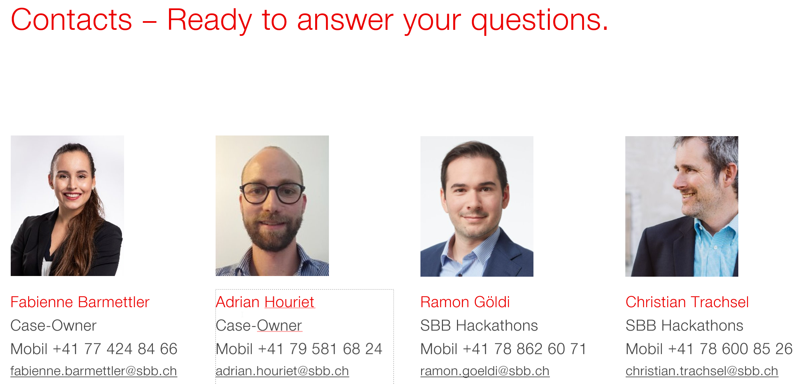

# SBB START HACK 2021

This is the main structure we would propose for the presentation of your START Hack Case.

Please feel free to provide participants with as much information, tools and tips & tricks as possible in order to ensure the best and most creative outcomes.

### Case Introduction

##### Case Pitch

Insert your Pitch Video or Slides here

##### Deep Dive Slides

Insert materials from your Deep Dives here

##### Further Information

### Resources
sold tickets / abo in the Park & App
https://data.sbb.ch/explore/dataset/parkrail-sale-app/information/

https://data.sbb.ch/explore/dataset/parkrail-sale-app-history/information/
sold tickets / abo in the other sales channels
https://data.sbb.ch/explore/dataset/parkrail-sale-backend/information/

Information about the trainstations in Switzerland https://data.sbb.ch/explore/dataset/dienststellen-gemass-opentransportdataswiss/information/
Information about the amount of trains at each Station https://data.sbb.ch/explore/dataset/anzahl-zuge-pro-haltestelle/table/?sort=betriebstag 

### Judging Criteria

we assess the solution on the basis of various areas.
- The user interface must be designed in an appealing way
- the suggestions made are correct in terms of content
- the technical implementation works.

### Point of Contact

 

### Prize

Let the participants know what will be expecting the winning Team!
