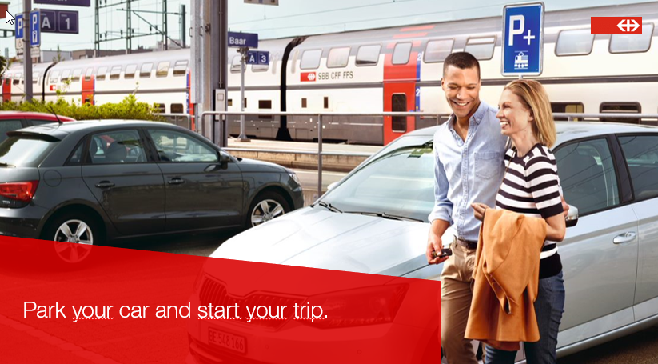

# Improve the occupancy forecast of P+Rail 

SBB START HACK 2021

The core of our challenge is that we would like to improve the occupancy forecast of our parking spaces at the train station.

 

### Case Introduction

##### Case Pitch

www.youtube.com/embed/qcij7Gzv5cc

##### Deep Dive 

https://www.youtube.com/watch?v=Cc1EROElu_Q&ab_channel=STARTGlobal

##### Further Information

The Swiss Federal Railways (SBB CFF FFS) is the national railway company of Switzerland. SBB moves people, goods and manages large amounts of infrastructure – be it with focus on railroads or real estate.

Our goals are offering rail excellence and at the same time shaping the mobility of the future. This includes combined mobility, where customers travel a fraction of their journey with a different mode of transportation. In our case: Driving to the train station with a car and then switching to a train ride. 

#### The challenge: Improve the occupancy forecast of «Park+Rail»

Precisely at this moment in our customer journey – the arrival of the combined mobility user at the «Park+Rail» parking lot – we would like to boost convenience and satisfaction with your valuable thoughts and ideas. Can you help us improve the occupancy forecast for our «Park+Rail» customers? 

#### Forecasting so far: majority of variables are known, but not the interaction

Today, we don’t know exactly which and by what amount different parameters influence the occupancy of our Park+Rail facilities. Different variables such as the size of the parking spaces, size of the train stations, the day of the week, weather conditions, public holidays, major outages and big events have been discussed. 

However, to the present day, we are still lacking a useful model for reliable occupancy parking spot prediction. Do you have a striking idea? 

### Resources
sold tickets / abo in the Park & App
https://data.sbb.ch/explore/dataset/parkrail-sale-app/information/ \
https://data.sbb.ch/explore/dataset/parkrail-sale-app-history/information/ \
https://data.sbb.ch/explore/dataset/parkrail-sale-app-2018/information \
sold tickets / abo in the other sales channels\
https://data.sbb.ch/explore/dataset/parkrail-sale-backend/information/
detailed Information about Burgdorf
https://data.sbb.ch/explore/dataset/parkrail-burgdorf/information/

Information about the trainstations in Switzerland https://data.sbb.ch/explore/dataset/dienststellen-gemass-opentransportdataswiss/information/ \
Information about the amount of trains at each Station https://data.sbb.ch/explore/dataset/anzahl-zuge-pro-haltestelle/table/?sort=betriebstag  \
Information about the amount of people at each Station https://data.sbb.ch/explore/dataset/passagierfrequenz/information/ \

### Judging Criteria

We assess the solution on the basis of various areas: 
- Your solution creates value for our clients and for SBB
- The suggestions made are correct in terms of content
- The technical implementation works and the user interface is designed in an appealing way
- A convincing presentation at the end

### Case Owners Fabienne and Adrian will be glad to answer your questions during the Deep Dive and on Saturday morning from 10.30 to 11.30. 
### In case you get stuck outside of these time slots, please liaise with Christian or Ramon on Discord or via mobile. 

 

### Prize

The winning team of our challenge will receive unique and original SBB messenger bags. Said bags are made from original SBB tarpaulin, which protected food etc. thousands of kilometres across Europe. Bag with zipper and shoulder strap and two carrying handles. Small external pocket with zipper and a variety of storage options inside: 1 pocket with zipper, 1 pocket with a Velcro closure with a clip hook on the inside, 1 padded compartment with Velcro closure. SBB label on the inside. 

Each bag is unique, handmade in Switzerland!

